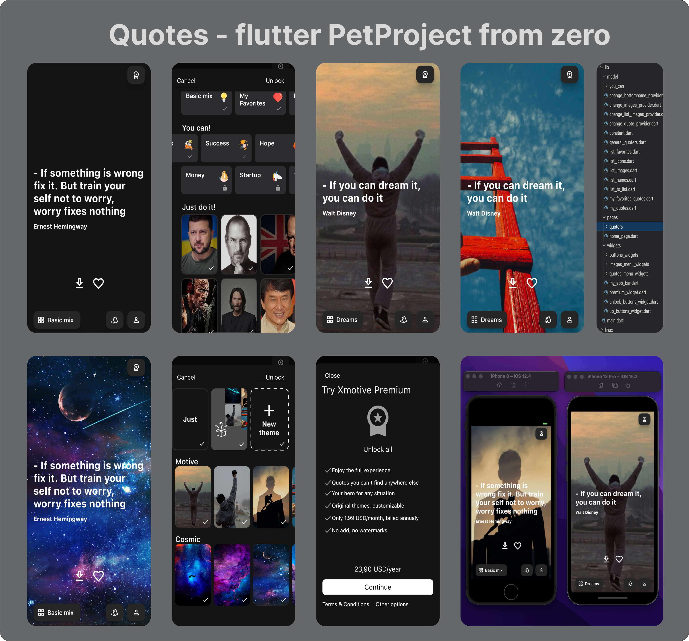

# Quotes-Pet_Flutter_Project_2
Quotes app: 2.5 weeks of implementation 

My Second Сommercial Flutter Project witch I'm going to add to AppStore/Google Play

The project is under development. This is just the initial part of the code. At the very beginning, I used the API, but then I abandoned it and made my own. As long as everything is stored locally.

1) One page is used here with Pageview swiping. The button at the bottom left allows you to go to the next screen - with a new list of quotes. 
2) All quotes, pictures are in the Lists. Calling a picture or quote by index. 
3) To navigate my main page I use a Provider. I don't create many pages - I have one page. 
4) Changing pictures is also a subscription to the Provider. All pictures are stored in their Lists. When you click on the button, the index is passed to the function and the initial variable is changed 
5) The share and favorite buttons are not yet ready. I can't figure out how to save the data. Hive...
6) Widgets - QuoteWidget- need to be refactored. There is no time for a universal widget yet. First I plan to do the unlock button. Logically, after pressing the Continue button, my unlock button will be equal to -true-

Watch the video by clicking on the image below

